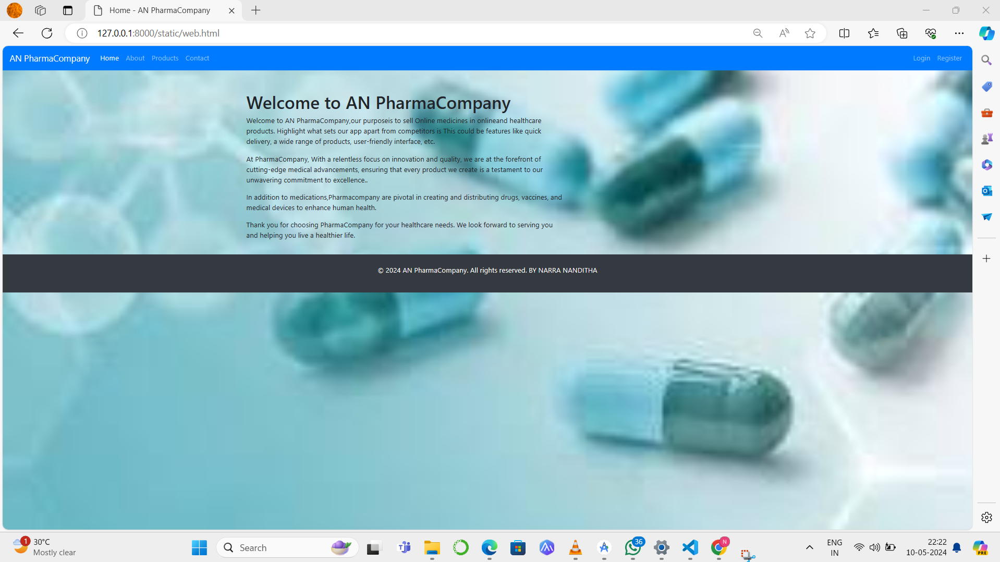
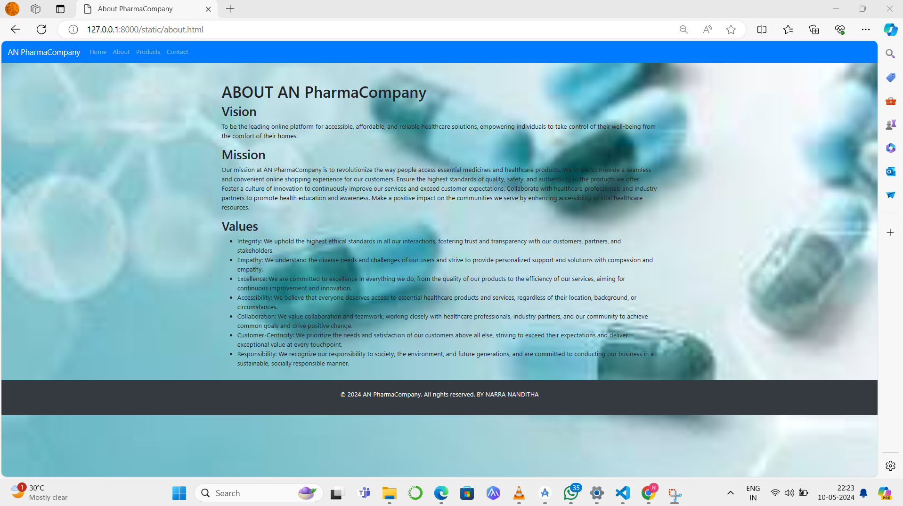
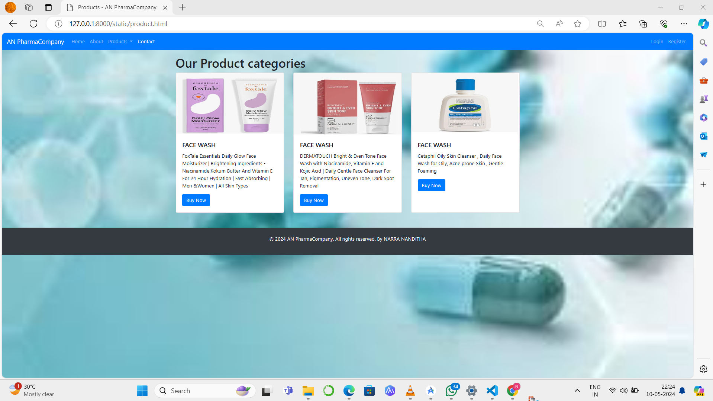
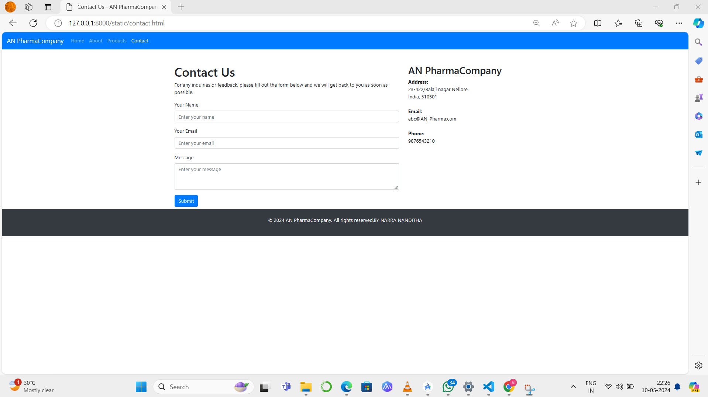

# Project Responsive Web Design using Bootstrap
## Date:10-05-2024

## AIM:
To design a responsive website for a Pharmaceutical Company using Bootstrap.


## DESIGN STEPS:

### Step 1:
Clone the repository from GitHub.

### Step 2:
Create Django Admin project.

### Step 3:
Create a New App under the Django Admin project.

### Step 4:
Insert the necessary CSS and JavaScript files as external in order to use Bootstrap.

### Step 5:
Create a HTML file and include the needed Bootstrap components.

### Step 6:
Publish the website in the LocalHost.

## PROGRAM :
```
web.html
```
```
<!DOCTYPE html>
<html lang="en">
<head>
  <meta charset="UTF-8">
  <meta name="viewport" content="width=device-width, initial-scale=1.0">
  <title>Home - AN PharmaCompany</title>
  <!-- Bootstrap CSS -->
  <link href="https://stackpath.bootstrapcdn.com/bootstrap/4.5.2/css/bootstrap.min.css" rel="stylesheet">
</head>
<body>

  <!-- Navbar -->
  <nav class="navbar navbar-expand-lg navbar-dark bg-primary">
    <a class="navbar-brand" href="#">AN PharmaCompany</a>
    <button class="navbar-toggler" type="button" data-toggle="collapse" data-target="#navbarSupportedContent" aria-controls="navbarSupportedContent" aria-expanded="false" aria-label="Toggle navigation">
      <span class="navbar-toggler-icon"></span>
    </button>

    <div class="collapse navbar-collapse" id="navbarSupportedContent">
      <ul class="navbar-nav mr-auto">
        <li class="nav-item active">
          <a class="nav-link" href="web.html">Home <span class="sr-only">(current)</span></a>
        </li>
        <li class="nav-item">
          <a class="nav-link" href="about.html">About</a>
        </li>
        <li class="nav-item">
          <a class="nav-link" href="product.html">Products</a>
        </li>
        <li class="nav-item">
          <a class="nav-link" href="contact.html">Contact</a>
        </li>
      </ul>
      <ul class="navbar-nav ml-auto">
        <li class="nav-item">
          <a class="nav-link" href="#">Login</a>
        </li>
        <li class="nav-item">
          <a class="nav-link" href="#">Register</a>
        </li>
      </ul>
    </div>
  </nav>

  <!-- Page Content -->
  <div class="container mt-5">
    <div class="row">
      <div class="col-md-8">
        <h1>Welcome to AN PharmaCompany</h1>
        <p>Welcome to AN PharmaCompany,our purposeis to sell Online medicines in onlineand healthcare products.
         Highlight what sets our app apart from competitors is This could be features like quick delivery, a wide range of products, user-friendly interface, etc.</p>
        <p>At PharmaCompany, With a relentless focus on innovation and quality, we are at the forefront of cutting-edge medical advancements, ensuring that every product we create is a testament to our unwavering commitment to excellence..</p>
        <p>In addition to medications,Pharmacompany are pivotal in creating and distributing drugs, vaccines, and medical devices to enhance human health. </p>
        <p>Thank you for choosing PharmaCompany for your healthcare needs. We look forward to serving you and helping you live a healthier life.</p>
      </div>
      <div class="col-md-4">
       
      </div>
    </div>
  </div>
  <body background="bg.jpeg" style="background-repeat: no-repeat; background-size: cover;">


  <!-- Footer -->
  <footer class="bg-dark text-white text-center py-4 mt-3">
    <p>&copy; 2024 AN PharmaCompany. All rights reserved. BY NARRA NANDITHA</p>
  </footer>

  <!-- Bootstrap JS -->
  <script src="https://code.jquery.com/jquery-3.5.1.slim.min.js"></script>
  <script src="https://cdn.jsdelivr.net/npm/popper.js@1.16.1/dist/umd/popper.min.js"></script>
  <script src="https://stackpath.bootstrapcdn.com/bootstrap/4.5.2/js/bootstrap.min.js"></script>
</body>
</html>
```
```
about.html
```
```
<!DOCTYPE html>
<html lang="en">
<head>
  <meta charset="UTF-8">
  <meta name="viewport" content="width=device-width, initial-scale=1.0">
  <title>About PharmaCompany</title>
  <!-- Bootstrap CSS -->
  <link href="https://stackpath.bootstrapcdn.com/bootstrap/4.5.2/css/bootstrap.min.css" rel="stylesheet">
</head>
<body>

  <!-- Navbar -->
  <nav class="navbar navbar-expand-lg navbar-dark bg-primary">
    <a class="navbar-brand" href="#">AN PharmaCompany</a>
    <button class="navbar-toggler" type="button" data-toggle="collapse" data-target="#navbarSupportedContent" aria-controls="navbarSupportedContent" aria-expanded="false" aria-label="Toggle navigation">
      <span class="navbar-toggler-icon"></span>
    </button>

    <div class="collapse navbar-collapse" id="navbarSupportedContent">
      <ul class="navbar-nav mr-auto">
        <li class="nav-item">
          <a class="nav-link" href="web.html">Home</a>
        </li>
        <li class="nav-item">
          <a class="nav-link" href="about.html">About</a>
        </li>
        <li class="nav-item">
          <a class="nav-link" href="product.html">Products</a>
        </li>
        <li class="nav-item">
          <a class="nav-link" href="#">Contact</a>
        </li>
      </ul>
    </div>
  </nav>

  <!-- Page Content -->
  <div class="container mt-5">
    <div class="row">
      <div class="col-md-12">
        <h1>ABOUT AN PharmaCompany</h1>
        <div id="vision">
          <h2>Vision</h2>
          <p>To be the leading online platform for accessible, affordable, and reliable healthcare solutions, empowering individuals to take control of their well-being from the comfort of their homes.</p>
        </div>
        <div id="mission">
          <h2>Mission</h2>
          <p>Our mission at AN PharmaCompany is to revolutionize the way people access essential medicines and healthcare products. We strive to:

            Provide a seamless and convenient online shopping experience for our customers.
            Ensure the highest standards of quality, safety, and authenticity in the products we offer.
            Foster a culture of innovation to continuously improve our services and exceed customer expectations.
            Collaborate with healthcare professionals and industry partners to promote health education and awareness.
            Make a positive impact on the communities we serve by enhancing accessibility to vital healthcare resources.</p>
        </div>
        <div id="values">
          <h2>Values</h2>
          <ul>
            <li>Integrity: We uphold the highest ethical standards in all our interactions, fostering trust and transparency with our customers, partners, and stakeholders.</li>
                <li> Empathy: We understand the diverse needs and challenges of our users and strive to provide personalized support and solutions with compassion and empathy.</li>
                    <li> Excellence: We are committed to excellence in everything we do, from the quality of our products to the efficiency of our services, aiming for continuous improvement and innovation.</li>
                        <li> Accessibility: We believe that everyone deserves access to essential healthcare products and services, regardless of their location, background, or circumstances.</li>
                            <li>Collaboration: We value collaboration and teamwork, working closely with healthcare professionals, industry partners, and our community to achieve common goals and drive positive change.</li>
                                <li>Customer-Centricity: We prioritize the needs and satisfaction of our customers above all else, striving to exceed their expectations and deliver exceptional value at every touchpoint.</li>
                                    <li>Responsibility: We recognize our responsibility to society, the environment, and future generations, and are committed to conducting our business in a sustainable, socially responsible manner.</li>
            
          </ul>
        </div>
        <!-- Add more subheadings as needed -->
      </div>
    </div>
  </div>
  <body background="bg.jpeg" style="background-repeat: no-repeat; background-size: cover;"></body>
  <!-- Footer -->
  <footer class="bg-dark text-white text-center py-4 mt-3">
    <p>&copy; 2024 AN PharmaCompany. All rights reserved.  BY NARRA NANDITHA</p>
  </footer>

  <!-- Bootstrap JS -->
  <script src="https://code.jquery.com/jquery-3.5.1.slim.min.js"></script>
  <script src="https://cdn.jsdelivr.net/npm/popper.js@1.16.1/dist/umd/popper.min.js"></script>
  <script src="https://stackpath.bootstrapcdn.com/bootstrap/4.5.2/js/bootstrap.min.js"></script>
</body>
</html>
```
```
product.html
```
```
<!DOCTYPE html>
<html lang="en">
<head>
  <meta charset="UTF-8">
  <meta name="viewport" content="width=device-width, initial-scale=1.0">
  <title>Products - AN PharmaCompany</title>
  <!-- Bootstrap CSS -->
  <link href="https://stackpath.bootstrapcdn.com/bootstrap/4.5.2/css/bootstrap.min.css" rel="stylesheet">
</head>
<body>

  <!-- Navbar -->
  <nav class="navbar navbar-expand-lg navbar-dark bg-primary">
    <a class="navbar-brand" href="#">AN PharmaCompany</a>
    <button class="navbar-toggler" type="button" data-toggle="collapse" data-target="#navbarSupportedContent" aria-controls="navbarSupportedContent" aria-expanded="false" aria-label="Toggle navigation">
      <span class="navbar-toggler-icon"></span>
    </button>
    <div class="collapse navbar-collapse" id="navbarSupportedContent">
      <ul class="navbar-nav mr-auto">
        <li class="nav-item">
          <a class="nav-link" href="web.html">Home</a>
        </li>
        <li class="nav-item">
          <a class="nav-link" href="about.html">About</a>
        </li>
        <li class="nav-item dropdown">
          <a class="nav-link dropdown-toggle" href="#" id="navbarDropdown" role="button" data-toggle="dropdown" aria-haspopup="true" aria-expanded="false">
            Products
          </a>
          <div class="dropdown-menu" aria-labelledby="navbarDropdown">
            <a class="dropdown-item" href="#">Over-the-counter (OTC) Medications</a>
            <a class="dropdown-item" href="#">Prescription Drugs</a>
            <a class="dropdown-item" href="#">Vaccines</a>
            <a class="dropdown-item" href="#">Supplements</a>
          </div>
        </li>
        <li class="nav-item active">
          <a class="nav-link" href="contact.html">Contact</a>
        </li>
      </ul>
      <ul class="navbar-nav ml-auto">
        <li class="nav-item">
          <a class="nav-link" href="#">Login</a>
        </li>
        <li class="nav-item">
          <a class="nav-link" href="#">Register</a>
        </li>
      </ul>
    </div>
  </nav>

  <!-- Page Content -->
  <div class="container mt-3">
    <div class="row">
      <div class="col-md-12">
        <h1>Our Product categories</h1>
        <div class="card-deck">
          <div class="card">
            
            <div class="card-body">
              <h5 class="card-title">FACE WASH</h5>
              <p class="card-text">FoxTale Essentials Daily Glow Face Moisturizer | Brightening Ingredients - Niacinamide,Kokum Butter And Vitamin E For 24 Hour Hydration | Fast Absorbing | Men &Women | All Skin Types</p>
              <a href="#" class="btn btn-primary">Buy Now</a>
            </div>
          </div>
          <div class="card">
            
            <div class="card-body">
              <h5 class="card-title">FACE WASH</h5>
              <p class="card-text">
                DERMATOUCH Bright & Even Tone Face Wash with Niacinamide, Vitamin E and Kojic Acid | Daily Gentle Face Cleanser For Tan, Pigmentation, Uneven Tone, Dark Spot Removal</p>
              <a href="#" class="btn btn-primary">Buy Now</a>
            </div>
          </div>
          <div class="card">
            
            <div class="card-body">
              <h5 class="card-title">FACE WASH</h5>
              <p class="card-text">Cetaphil Oily Skin Cleanser , Daily Face Wash for Oily, Acne prone Skin , Gentle Foaming</p>
              <a href="#" class="btn btn-primary">Buy Now</a>
            </div>
          </div>
        </div>
      </div>
    </div>
  </div>

  <!-- Footer -->
  <footer class="bg-dark text-white text-center py-4 mt-5">
    <p>&copy; 2024 AN PharmaCompany. All rights reserved. By NARRA NANDITHA</p>
  </footer>
  <body background="bg.jpeg" style="background-repeat: no-repeat; background-size: cover;">


  <!-- Bootstrap JS -->
  <script src="https://code.jquery.com/jquery-3.5.1.slim.min.js"></script>
  <script src="https://cdn.jsdelivr.net/npm/popper.js@1.16.1/dist/umd/popper.min.js"></script>
  <script src="https://stackpath.bootstrapcdn.com/bootstrap/4.5.2/js/bootstrap.min.js"></script>
</body>
</html>
```
```
<!DOCTYPE html>
<html lang="en">
<head>
  <meta charset="UTF-8">
  <meta name="viewport" content="width=device-width, initial-scale=1.0">
  <title>Contact Us - AN PharmaCompany</title>
  <!-- Bootstrap CSS -->
  <link href="https://stackpath.bootstrapcdn.com/bootstrap/4.5.2/css/bootstrap.min.css" rel="stylesheet">
</head>
<body>

  <!-- Navbar -->
  <nav class="navbar navbar-expand-lg navbar-dark bg-primary">
    <a class="navbar-brand" href="#">AN PharmaCompany</a>
    <button class="navbar-toggler" type="button" data-toggle="collapse" data-target="#navbarSupportedContent" aria-controls="navbarSupportedContent" aria-expanded="false" aria-label="Toggle navigation">
      <span class="navbar-toggler-icon"></span>
    </button>

    <div class="collapse navbar-collapse" id="navbarSupportedContent">
      <ul class="navbar-nav mr-auto">
        <li class="nav-item">
          <a class="nav-link" href="web.html">Home</a>
        </li>
        <li class="nav-item">
          <a class="nav-link" href="about.html">About</a>
        </li>
        <li class="nav-item">
          <a class="nav-link" href="product.html">Products</a>
        </li>
        <li class="nav-item active">
          <a class="nav-link" href="contact.html">Contact <span class="sr-only">(current)</span></a>
        </li>
      </ul>
    </div>
  </nav>

  <!-- Page Content -->
  <div class="container mt-5">
    <div class="row">
      <div class="col-md-8">
        <h1>Contact Us</h1>
        <p>For any inquiries or feedback, please fill out the form below and we will get back to you as soon as possible.</p>
        <form>
          <div class="form-group">
            <label for="name">Your Name</label>
            <input type="text" class="form-control" id="name" placeholder="Enter your name">
          </div>
          <div class="form-group">
            <label for="email">Your Email</label>
            <input type="email" class="form-control" id="email" placeholder="Enter your email">
          </div>
          <div class="form-group">
            <label for="message">Message</label>
            <textarea class="form-control" id="message" rows=3" placeholder="Enter your message"></textarea>
          </div>
          <button type="submit" class="btn btn-primary">Submit</button>
        </form>
      </div>
      <div class="col-md-4">
        <h2>AN PharmaCompany</h2>
        <address>
          <strong>Address:</strong><br>
          23-422/Balaji nagar Nellore<br>
          India, 510501<br><br>
          <strong>Email:</strong><br>
          abc@AN_Pharma.com<br><br>
          <strong>Phone:</strong><br>
          9876543210
        </address>
      </div>
    </div>
  </div>
  <body background="back.png" style="background-repeat: no-repeat; background-size: cover;">


  <!-- Footer -->
  <footer class="bg-dark text-white text-center py-4 mt-2">
    <p>&copy; 2024 AN PharmaCompany. All rights reserved.BY NARRA NANDITHA</p>
  </footer>

  <!-- Bootstrap JS -->
  <script src="https://code.jquery.com/jquery-3.5.1.slim.min.js"></script>
  <script src="https://cdn.jsdelivr.net/npm/popper.js@1.16.1/dist/umd/popper.min.js"></script>
  <script src="https://stackpath.bootstrapcdn.com/bootstrap/4.5.2/js/bootstrap.min.js"></script>
</body>
</html>
```
## OUTPUT:






## RESULT:
The Project for responsive web design using Bootstrap is completed successfully.
